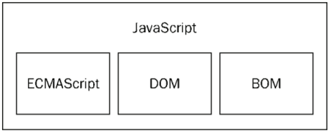
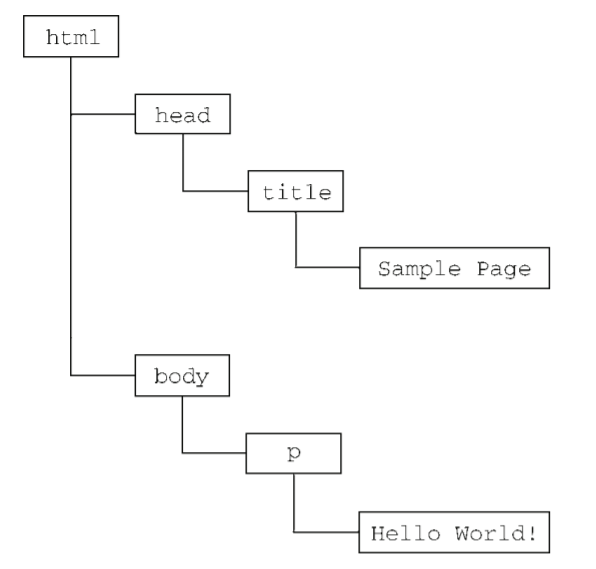
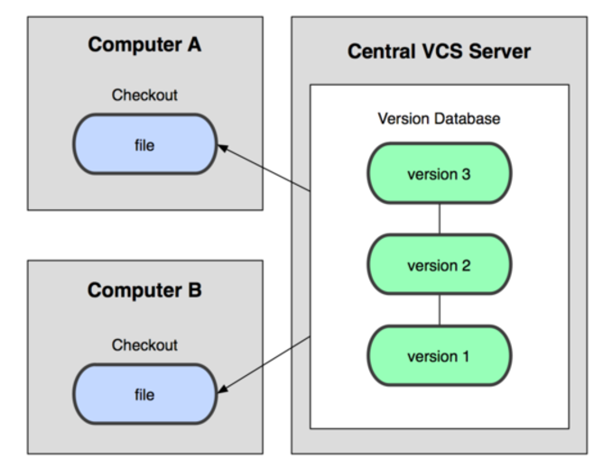
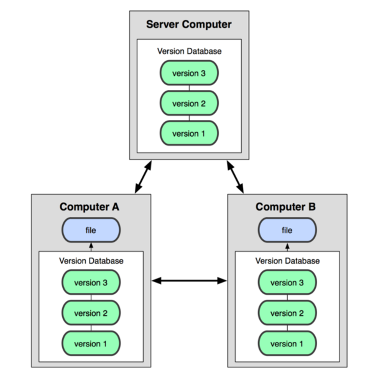

# 2016-2017学年前端第三次大课

### 讲在前面

+ 关于切图


+ 书籍推荐
  - Javascript高级程序设计(红宝书)
  - Javascript权威指南(犀牛书)
  - Dom编程艺术


+ 前端语言

***


### Javascript简介

+ 什么是Javascript
+ Javascript能做什么
  + 前端
  + 后端
  + App
  + 桌面应用
  + 游戏


+ Javascript实现的组成部分

  ​                                        

  ​

  - 核心（ECMAScript） 

    > ECMA-262 定义的 ECMAScript 与 Web 浏览器没有依赖关系。实际上，这门语言本身并不包含输入和输出定义。ECMA-262 定义的只是这门语言的基础，而在此基础之上可以构建更完善的脚本语言。我们常见的 Web 浏览器只是 ECMAScript 实现可能的宿主环境之一。宿主环境不仅提供基本的ECMAScript 实现，同时也会提供该语言的扩展，以便语言与环境之间对接交互。而这些扩展——如DOM，则利用 ECMAScript 的核心类型和语法提供更多更具体的功能，以便实现针对环境的操作。其他宿主环境包括 Node（一种服务端 JavaScript 平台）和 Adobe Flash。既然 ECMA-262 标准没有参照 Web 浏览器，那它都规定了些什么内容呢？大致说来，它规定了这门语言的下列组成部分：
    >
    >  语法
    >
    >  类型
    >
    >  语句
    >
    >  关键字
    >
    >  保留字
    >
    >  操作符
    >
    >  对象
    >
    > ECMAScript 就是对实现该标准规定的各个方面内容的语言的描述。JavaScript 实现了 ECMAScript，Adobe ActionScript 同样也实现了 ECMAScript。

  - 文档对象模型（DOM）

    > 文档对象模型（DOM，Document Object Model）是针对 XML 但经过扩展用于 HTML 的应用程序编程接口（API，Application Programming Interface）。DOM 把整个页面映射为一个多层节点结构。HTML或 XML 页面中的每个组成部分都是某种类型的节点，这些节点又包含着不同类型的数据。

    ```html
    <html>
    <head>
        <title>Sample Page</title>
    </head>
    <body>
        <p>Hello World!</p>
    </body>
    </html>
    ```

  ​

  ​                                 

  例子：

  ```javascript
  var p = document.querySelector('body');
  var node = document.createElement("p");
  console.log(p);
  p.appendChild(node);    
  ```

  ​

  ​

  + 浏览器对象模型（BOM）

    > Internet Explorer 3和 Netscape Navigator 3有一个共同的特色，那就是支持可以访问和操作浏览器窗 口的浏览器对象模型（BOM，Browser Object Model）。开发人员使用 BOM可以控制浏览器显示的页面 以外的部分。而 BOM真正与众不同的地方（也是经常会导致问题的地方），还是它作为 JavaScript实现 的一部分但却没有相关的标准。这个问题在 HTML5中得到了解决，HTML5致力于把很多 BOM功能写 入正式规范。HTML5发布后，很多关于 BOM的困惑烟消云散。 从根本上讲，BOM只处理浏览器窗口和框架；但人们习惯上也把所有针对浏览器的 JavaScript扩展 算作 BOM的一部分。下面就是一些这样的扩展：
    >
    >   弹出新浏览器窗口的功能； 
    >
    >  移动、缩放和关闭浏览器窗口的功能； 
    >
    >  提供浏览器详细信息的 navigator 对象； 
    >
    >  提供浏览器所加载页面的详细信息的 location 对象； 
    >
    >  提供用户显示器分辨率详细信息的 screen 对象； 
    >
    >  对 cookies的支持； 
    >
    >  像 XMLHttpRequest 和 IE的 ActiveXObject 这样的自定义对象。 
    >
    > 由于没有 BOM标准可以遵循，因此每个浏览器都有自己的实现。虽然也存在一些事实标准，例如 要有 window 对象和 navigator 对象等，但每个浏览器都会为这两个对象乃至其他对象定义自己的属 性和方法。现在有了 HTML5，BOM实现的细节有望朝着兼容性越来越高的方向发展

  例子：

  ```javascript
  var pageWidth = window.innerWidth,     
  pageHeight = window.innerHeight;
  console.log(pageWidth);
  console.log(pageHeight);


  var result = prompt("What is your name? ", ""); 
  	if (result !== null) {
       	alert("Welcome, " + result); 
      } 

  ```

  ​

### 如何使用Javascript

+ <script>元素
+ 嵌入代码与外部文件

### Javascript基本概念

+ 语法

  - 大小写区分
  - 标识符
  - 注释

+ 变量

+ 分号

+ 数据类型(隐式转换

  ```javascript
  (!(~+[])+{})[--[~+""][+[]]*[~+[]]+~~!+[]]+({}+[])[[~!+[]*~+[]]]
  ```

  - Undefined
  - Boolean
  - String
  - Number
  - Null
  - Object

  问题：

  ~~~javascript
  "B" + "a" + + "B" + "a";

  1 + '1';

  1 - '1';

  1 + true + '';
  ~~~

   

+ 操作符

  - 一元操作符

    ```javascript
    var num1 = 2; 
    var num2 = 20; 
    var num3 = --num1 + num2;      
    var num4 = num1 + num2; 

    //执行前置递增和递减操作时，变量的值都是在语句被求值以前改变的。
    ```

    ​

  - 布尔操作符

    ​

    

    

  - 相等操作符与赋值操作符

  - 条件操作符

    ```javascript
    var max = (num1 > num2) ? num1 : num2;
    ```

    ​

+ 语句

  - if语句

  - do-while

  - while

  - for

  - switch

    ```javascript
    if (i == 25){   
      alert("25"); 
    } else if (i == 35) {
      alert("35"); 
    } else if (i == 45) {
      alert("45"); 
    } else {
      alert("Other"); 
    }


    switch (i) {
      case 25:          
        alert("25");
        break;
      case 35:          
        alert("35");         
        break;     
      case 45:          
        alert("45");         
        break;     
      default:          
        alert("Other"); 
    } 

    ```

    ​

+ 函数

  - 参数

    例子:

    ```javascript
    function sayHi(name, message) {
    	alert("Hello " + name + "," + message);
    }
    sayHi("psx", "nihao");
    ```

  - 没有重载(如果在 ECMAScript中定义了两个名字相同的函数，则该名字只属于后定义的函数。)

    ```javascript
    function addSomeNumber(num){     
    	return num + 100; 
    } 
     
    function addSomeNumber(num) {
        return num + 200; 
    } 
     
    var result = addSomeNumber(100);
    ```

    ​

### Git（分布式版本控制系统）

+ 集中式与分布式

  



+ Git工作流程
+ 安装Git
+ 注册Github
+ 使用Git